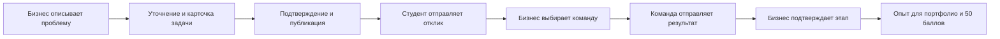

# Alem Practice

**Знания — в дело. Идеи — в проекты.**

Alem Practice — платформа, на которой студенты учатся через практические задачи бизнеса. Компания описывает проблему, команда предлагает решение, выполняет работу и получает подтверждённый результат для портфолио.

Проект команды **RDM code** для **HackAlem**, трек **«Образование»**.

[Запуск и настройки](./alem-practice/README.md) · [Сценарий презентации](./alem-practice/DEMO.md) · [Публикация сайта](./alem-practice/DEPLOYMENT.md) · [Проверки](./alem-practice/VERIFICATION.md)

## Какую проблему решает продукт

Студентам нужны понятные задачи, чтобы применить знания и получить опыт. Бизнесу бывает трудно превратить пожелание «хотим что-то улучшить» в задание: объяснить проблему, подготовить данные и определить, какой результат нужен.

Alem Practice соединяет эти две стороны. Бизнес оформляет задачу с помощью конструктора и AI-подсказок, а студент видит, чему научится, что нужно знать заранее и какой проект сможет добавить в портфолио.

### Где здесь образование

В каждой задаче есть учебная часть: **навыки, необходимые знания, сложность и результат для портфолио**. Студент проходит путь от анализа проблемы до работающего решения, а заказчик проверяет результат по описанным критериям. Геймификация поддерживает этот процесс: платформа показывает прогресс и начисляет баллы за подтверждённый этап.

**Простой пример:** кафе хочет лучше планировать закупки. Студенты берут учебную таблицу продаж, анализируют спрос и создают прототип рекомендаций. Они практикуются в очистке данных, прогнозировании и проверке гипотез. Заказчик проверяет результат, после чего у команды появляются подтверждённый этап, баллы и материал для портфолио.

## Как всё работает



### 1. Регистрация и профиль

Пользователь выбирает роль — **студент** или **бизнес**, указывает имя, логин и пароль. Телефон и SMS не нужны.

- Логин: 3–24 символа, латинские буквы, цифры и `_`; начинается с буквы. Регистр букв не важен.
- Пароль: 12–128 символов с повторным вводом при регистрации.
- В профиле можно указать город, место обучения, описание, навыки, интересы, портфолио и название команды или организации.
- Публикацию личного профиля в сообществе включает сам пользователь.

Без регистрации можно смотреть опубликованные задачи и публичные профили. Чтобы создавать задачи, отправлять отклики и сохранять свои данные, нужен аккаунт.

### 2. Бизнес создаёт задачу

В конструкторе бизнес описывает свою проблему. AI-помощник предлагает уточняющие вопросы и помогает подготовить карточку. Владелец проверяет и редактирует содержание, подтверждает сведения и публикует задачу.

Карточка содержит контекст, потребность, данные, ожидаемый результат, критерии успеха, ограничения, целевых пользователей, контакт и формат взаимодействия. Отдельно указываются учебные навыки и результат для портфолио.

Черновик виден владельцу. После изменения опубликованной карточки её нужно заново подтвердить и опубликовать.

### 3. Студент выбирает практику

В каталоге доступны поиск по задаче, компании или навыку, фильтры направления и готовности. Есть пять исходных направлений: анализ данных, веб-разработка, поиск и UX, бизнес-аналитика, образовательные технологии.

Диаграмма показывает распределение опубликованных задач по направлениям. Нажатие на сегмент включает соответствующий фильтр. Счётчики рассчитываются по данным сайта.

### 4. Команда отправляет отклик

В отклике студент описывает идею решения, план, срок и ссылку на прототип, при необходимости добавляет предположения. Бизнес просматривает предложения в своём кабинете и вручную выбирает команды. Для одной задачи можно выбрать несколько команд.

Одинаковый повторный отклик не создаёт дубликат. Рабочие отклики видят отправившая их команда и владелец задачи; публично доступны только учебные примеры откликов.

### 5. Результат подтверждается

После выбора команды появляется этап **«Первый прототип»**. Команда отправляет описание результата и ссылку на работу. Бизнес проверяет их и подтверждает этап.

За подтверждённый этап команда получает **50 баллов практики один раз**. Повторное подтверждение не увеличивает награду. В разделе «Моя практика» отображаются отклики, выбранные проекты, отправленные результаты и подтверждённые этапы.

## Что означают рейтинг и баллы

**Рейтинг задачи от 0 до 100** показывает полноту подтверждённого описания. Вес полей:

- Контекст — 10; потребность — 10.
- Данные и материалы — 20.
- Ожидаемый результат — 15; критерии успеха — 15.
- Ограничения — 10; целевые пользователи — 10.
- Контакт — 5; формат взаимодействия — 5.

Поле приносит баллы после заполнения и подтверждения. Пустые значения и ответы вроде «не знаю» баллов не дают. Уровни: **0–39 — «Черновик»**, **40–69 — «Рабочая»**, **70–89 — «Готовая»**, **90–100 — «Приоритетная»**.

Этот показатель оценивает полноту сведений, а не качество будущего решения или престиж компании. Статус публикации учитывается отдельно: даже задача с уровнем «Черновик» может быть опубликована, если потребность заполнена и подтверждена. Низкий рейтинг не запрещает откликаться.

**Баллы команды** начисляются за подтверждённую практику. Это отдельный показатель, который не меняет рейтинг задачи.

## Что делает AI

AI помогает структурировать исходное описание, задавать уточняющие вопросы и предлагать содержание карточки. Решение о публикации задачи, выборе команды и подтверждении результата принимает человек.

По умолчанию используется **демонстрационный режим**: он работает без ключей и платных запросов. В backend также подготовлены серверные адаптеры OpenAI и совместимого API. Если внешний сервис недоступен или ответ не проходит проверку, приложение возвращает явно отмеченный демонстрационный результат.

Инструкция подключения и ограничения описаны в [техническом README](./alem-practice/README.md). Ключи хранятся только на сервере в `.env` или окружении хостинга.

## Интерфейс и визуализации

В дизайне используются тёмно-синий фон навигации, фиолетовые акценты, зелёные кнопки и цветные направления задач. Главный экран содержит объёмную образовательную иллюстрацию; карточки реагируют на указатель, переходы и элементы плавно анимируются.

Диаграмма направлений помогает выбирать задачи, круговой индикатор объясняет готовность карточки, а кабинет показывает прогресс практики. Интерфейс адаптирован к мобильной ширине. Эффекты можно отключить; системная настройка сокращения движения также учитывается.

## Технологии и хранение данных

- **Frontend:** React, TypeScript, Next.js App Router.
- **Backend:** серверные API-маршруты Next.js; отдельный backend-сервис для запуска не требуется.
- **База данных:** SQLite; доступ и миграции через Prisma.
- **Проверка данных:** Zod.
- **UI:** CSS/SVG, Radix Dialog и Lucide. Объёмные эффекты сделаны без тяжёлого WebGL-движка.

Браузер отправляет запросы серверу. Сервер определяет пользователя по сессии, проверяет права, выполняет действие и сохраняет данные в базе. Профили и проекты сохраняются между перезапусками, пока сохраняется файл базы.

Пароли хранятся в виде хешей scrypt с индивидуальной солью. Сессии используют HttpOnly/SameSite cookies; при HTTPS включается Secure. Есть ограничения попыток входа и проверка разрешённых адресов запросов. Каждое устройство получает собственную сессию на семь дней. В профиле можно завершить все сессии.

## Быстрый запуск

Нужны **Git, Node.js 22.14+ и npm**. Команды ниже — для PowerShell на Windows. Если репозиторий уже скачан, перейдите в его папку `alem-practice` и пропустите клонирование.

```powershell
git clone https://github.com/BAITC-Hacks/hack-8e42af59-rdm-code.git
cd hack-8e42af59-rdm-code/alem-practice
npm ci
Copy-Item .env.example .env
npm run setup
npm run dev
```

Откройте [http://127.0.0.1:3000](http://127.0.0.1:3000). Для закрытого репозитория потребуется доступ вашего GitHub-аккаунта.

`npm run setup` генерирует Prisma Client, применяет миграции и добавляет учебные примеры. `.env` копируется при первой настройке; существующий файл при обновлении заменять не нужно. По умолчанию база находится в `alem-practice/prisma/dev.db`.

Для последующих запусков достаточно `npm run dev`. Для выступления с готовой сборкой:

```powershell
npm run build
npm start
```

### Вход с другого устройства в общей сети

```powershell
npm run build
npm run start:lan
```

Команда покажет IP-адреса компьютера. Подключите телефон или второй компьютер к той же сети и откройте подходящий адрес, например `http://192.168.1.25:3000`. Используйте **адрес из своего терминала**. Затем войдите с тем же логином и паролем — профиль и проекты будут общими.

На телефоне `localhost` означает сам телефон. Чтобы обратиться к компьютеру с сервером, нужен его IP. Компьютер должен оставаться включённым, а сервер — запущенным. Гостевой Wi-Fi может запрещать связь между устройствами; подробности есть в [инструкции запуска](./alem-practice/README.md).

Если порт 3000 занят:

```powershell
$env:PORT='3002'
npm run start:lan
```

Для доступа через интернет нужен опубликованный сервер с HTTPS и постоянным диском для базы. GitHub хранит код, но сам по себе не запускает этот сайт. Порядок размещения описан в [DEPLOYMENT.md](./alem-practice/DEPLOYMENT.md).

## Учебные задачи и датасеты

Начальное наполнение: **25 задач, 5 организаций, 5 команд и 5 откликов**. Все исходные организации, команды и данные вымышлены и обозначены как учебные. Новые пользователи создают собственные профили и задачи; число записей после этого может увеличиваться.

Пять стартовых наборов данных:

- Продажи кафе — для анализа спроса и планирования закупок.
- Продажи магазина — для анализа ассортимента и экономики товаров.
- Данные кампуса — для визуализации потребления энергии и поиска аномалий.
- Онлайн-курсы — для изучения прохождения и оттока студентов.
- Библиотека — для поиска книг, анализа интересов и учебных сервисов.

Файлы и их описание находятся в [public/datasets](./alem-practice/public/datasets/README.md). Они синтетические и предназначены для обучения и демонстрации.

## Структура репозитория

```text
README.md                         ← описание продукта
alem-practice/                    ← приложение; команды npm выполняются здесь
  app/                            ← страницы и API-маршруты
  components/                     ← формы, карточки, кабинеты, визуализации
  lib/                            ← авторизация, права, AI и бизнес-правила
  prisma/                         ← схема, миграции и наполнение базы
  data/                           ← исходные учебные кейсы
  public/datasets/                ← скачиваемые CSV и JSON
  scripts/                        ← запуск в сети и проверки
  tests/                          ← автоматические тесты
  docs/BACKEND_CONTRACT.md         ← контракт API
  README.md                       ← подробные настройки
  DEMO.md                         ← сценарий выступления
  DEPLOYMENT.md                   ← инструкция публикации
  VERIFICATION.md                 ← результаты проверки
```

## Проверка проекта

В папке `alem-practice`:

```powershell
npm run typecheck
npm run lint
npm test
npm run build
npm run test:http
npm run test:auth-http
```

На момент последней проверки прошли **20 автоматических тестов**, сборка и оба HTTP-сценария. Проверяются вход и независимые сессии, права доступа, работа с задачами и откликами, однократное начисление награды и сохранение после перезапуска. Тесты используют временные базы; AI проверяется с подменой ответов без платных запросов. Подробности — в [VERIFICATION.md](./alem-practice/VERIFICATION.md).

## Границы текущего MVP

Реализованы полный путь от регистрации до подтверждения этапа, личные профили, каталог, отклики и прогресс. При этом:

- Восстановление и смена пароля через интерфейс пока не подключены.
- Профилем команды управляет один аккаунт; приглашений и совместного редактирования ещё нет.
- В текущем процессе у выбранного отклика один этап — «Первый прототип».
- Учебные данные не подтверждают качество решения на реальном бизнесе; это проверяется отдельно.
- Публичный хостинг не развёрнут. SQLite рассчитана на текущую схему с одним сервером и постоянным диском.

## Как показать продукт за 3–4 минуты

Начните с каталога и учебных навыков в задаче. Покажите новый профиль, затем из аккаунта бизнеса создайте и опубликуйте задачу. Из аккаунта студента отправьте отклик; бизнес выберет команду и подтвердит присланный результат. Завершите показ обновившимся прогрессом и начислением 50 баллов.

Для демонстрации двух ролей используйте разные браузеры или устройства. Пошаговый сценарий — в [DEMO.md](./alem-practice/DEMO.md).

**Alem Practice помогает пройти путь от изученного навыка к выполненной задаче и подтверждённому опыту.**
